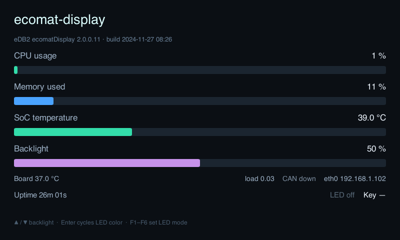

# Slint Spike — Option B (custom Platform on the HAL)

**Goal:** prove a real UI framework (Slint) can drive the CR1140 display through
our HAL instead of hand-rolled pixel loops, while keeping the easy
**static-musl** toolchain (no libdrm/libinput/libudev/fontconfig).

**Result: works, on-device, and is now the autostart app.** A statically linked
aarch64 binary renders a live dashboard into `/dev/fb0`, reads the keypad via
evdev, and drives backlight + LED on key press. It runs as `cr1140-app.service`
(enabled), having replaced the earlier hand-rolled pixel demo.

Real device values on the dashboard (all read from the running device):
- hostname + firmware/build from `/etc/os-release`
- CPU% (`/proc/stat`), memory% (`/proc/meminfo`), uptime (`/proc/uptime`),
  1-min load (`/proc/loadavg`)
- **SoC temperature** (`thermal_zone0`, cpu-thermal) and a distinct **board
  temperature** (onboard `lm75` via hwmon)
- backlight % (sysfs), keypad LED state
- `eth0` IP (via `getifaddrs` — works on an isolated LAN with no default
  gateway) and `can0` link state. Network fields refresh every tick, since at
  boot the app starts before networking is up.



## Architecture

Slint's pure-Rust **software renderer** + a custom `slint::platform::Platform`
(no system backend). The render path reuses the HAL:

```
Slint SoftwareRenderer ──renders──▶ Vec<Xrgb8888>  (our TargetPixel impl)
                                          │ blit (row-wise, honours fb stride)
cr1140_hal::display::FbDisplay::surface() ◀┘  ──mmap──▶ /dev/fb0
cr1140_hal::input::ButtonReader (evdev) ──▶ Slint property updates / HAL actions
cr1140_hal::sys + /proc ────────────────▶ live metric values
```

Keypad input (live):
- **Enter** cycles the RGB LED color: off → green → yellow → orange → red → blue.
- **F1–F6** set the LED animation mode: solid / 50% / pulse / blink / flash /
  heartbeat. Color × mode are orthogonal; the render loop samples the mode's
  brightness curve each frame and scales the chosen color, writing the three
  sysfs channels only when a value changes. (Curves are pure fns in `src/led.rs`,
  unit-tested. Verified end-to-end on-device by injecting F3 via a uinput
  virtual keyboard and watching the green channel ramp 0→249 — the pulse breathe.)
- **▲ / ▼** adjust the display backlight.

Files (`cr1140-slint-demo/`):
- `src/pixel.rs` — `Xrgb8888`, implements Slint's `TargetPixel` so the renderer
  writes the framebuffer's exact byte layout (LE `[B,G,R,X]`); no conversion on blit.
- `src/led.rs` — keypad-LED animation modes as pure brightness curves over time.
- `src/platform.rs` — `FbPlatform`: one `MinimalSoftwareWindow`, `duration_since_start`
  from `std::time::Instant`. No `run_event_loop` — we drive the super-loop ourselves.
- `src/metrics.rs` — pure `/proc` parsers (CPU%, mem%, uptime) + unit tests.
- `src/main.rs` — super-loop: `update_timers_and_animations` → drain buttons →
  refresh metrics ~1 Hz → `draw_if_needed(render)` → blit only when dirty.
- `ui/app.slint` — dashboard, built-in elements only (no `std-widgets`).
- `build.rs` — `EmbedForSoftwareRenderer` (embeds glyphs/resources into the binary).

## Toolchain findings (the whole point of Option B)

1. **`renderer-software` + Slint's `std` feature pulls `fontconfig`** on Linux
   (system-font loading via `yeslogic-fontconfig-sys`), which breaks the musl
   cross-build (`pkg-config has not been configured to support cross-compilation`).
   **Fix:** use the MCU feature set — `default-features = false`, features
   `["compat-1-2", "unsafe-single-threaded", "libm", "renderer-software"]`. Our
   own binary still links `std`; only Slint is built no-std-style. Fonts are then
   **embedded** at build time. Net: a single static musl binary, no C deps.

2. **`EmbedForSoftwareRenderer` only embeds ASCII + non-ASCII glyphs that appear
   literally in the `.slint` source.** A `°` used only in a runtime `format!`
   string rendered blank, while `→ ▲ ▼` (literals in the markup) rendered fine.
   **Fix:** keep units/symbols in the `.slint` (`value: temp + " °C"`), so the
   glyph is in the source and gets embedded.

## Build / run

```
just build-slint     # cross-compile static musl aarch64
just run-slint       # stop autostart app, deploy, run on device
```

## Where this leaves the HAL

The framework owns rendering/redraw/layout/fonts (far better than the manual
full-frame loop). The HAL remains the non-GUI hardware layer: framebuffer
ownership, evdev input bridging, sysfs LEDs/backlight, temperature, CAN. That
split is exactly Option B.

## Autostart

Promoted to `cr1140-app.service` (`deploy/cr1140-app.service` →
`ExecStart=/home/cds-apps/cr1140-slint-demo`). `app-launcher.service` and
`codesys.service` stay masked, so the app keeps exclusive `/dev/fb0` ownership
across reboots. `deploy/install.sh` performs the masking on a fresh device.

## Not done (out of spike scope)

- Dispatching evdev keys as Slint key events (we update properties / drive HW
  directly instead — fine for a fixed-function panel).
- Partial-region blit (we blit the full frame when dirty; cheap at 800×480).
