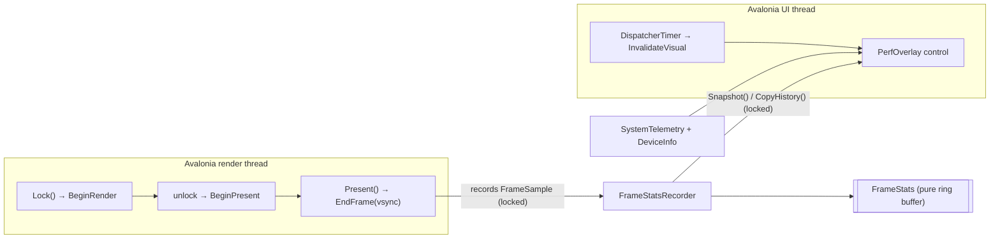

# Performance / telemetry overlay for `Cr1140.Avalonia`

- **Date:** 2026-09-03
- **Status:** Approved design — ready for implementation plan
- **Package:** `Cr1140.Avalonia` (target `0.9.0`)
- **New namespace:** `Cr1140.Avalonia.Diagnostics`

## 1. Context & goal

Game engines and profilers ship a live performance overlay (FPS, frame
time, CPU/GPU split, rolling graphs, environment block). We want the same
capability integrated into the `Cr1140.Avalonia` NuGet package so any
consuming operator-panel app — and the reference `cr1140-avalonia-demo` —
can drop a real, on-device performance HUD over its UI.

The reference overlay (a game-engine HUD) shows: a large **FPS** and
**mspf** header with a V-Sync indicator and a frame counter; a table of
**Average / Best / Worst / Last** for **Total / CPU / GPU** frame time;
scrolling sparklines for each; and a lower **environment block** (CPU
model, OS, rendering method, viewport, scale, AA, etc.).

### Device reality (what maps, what doesn't)

Target: ifm CR1140/CR1141 ecomatDisplay 4.3″, NXP **i.MX 8M Nano**,
aarch64, Linux 5.19, 800×480 panel. Verified live at `10.10.10.229`:
`/dev/fb0`, `/dev/dri/card0`, `/dev/input/event1` all present; 2 CPU
cores; `.NET 8.0.2` runtime installed; device-tree model
`ifm i.MX8MNano VHIP4 PDM3`; thermal `thermal_zone0` = `cpu-thermal`.

- **No GPU.** Rendering is **software Skia** (the i.MX 8M Nano has no
  usable GL driver — this is why the package ships CPU-blit output
  backends). The reference's **GPU** row is therefore repurposed to
  **Present** (the software present path), and the rendering-method line
  reads "Software Skia (CPU)".
- **Retained-mode, not a game loop.** Avalonia only presents on
  invalidation, so an idle UI presents zero frames. The overlay
  **honestly reports the present rate it induces**: while visible it
  drives a steady redraw (see §6) so FPS/mspf and the sparklines are
  meaningful; the numbers are real presented frames, not a synthetic loop.

## 2. Non-goals

- No GL/GPU timing (none exists on this SoC).
- No new telemetry collectors beyond a small `DeviceInfo` extension —
  the environment block reuses the existing `SystemTelemetry`/`DeviceInfo`.
- No Avalonia key injection. The optional toggle only flips overlay
  visibility (consistent with the package's app-driven-navigation ethos).
- No change to the rotation model, DPI, or present semantics of the
  output backends — instrumentation is additive and null-safe.

## 3. Approach & rejected alternative

**Chosen: instrument the output backends.** `RotatingDrmOutput` and
`RotatingFbdevOutput` own the only real present boundary — `Lock()` hands
Skia a back buffer, the unlock callback runs `Present()` /
`BlitToDevice()`. That boundary yields three true timings per frame with
no GPU:

| Metric  | Measured span                                    | Reference row |
|---------|--------------------------------------------------|---------------|
| Render  | `Lock()` → unlock callback (Skia rasterize)      | CPU           |
| Present | inside `Present()`/`BlitToDevice()` (rotate-blit + page-flip/vsync wait) | GPU |
| Total   | present-end → next present-end (on-panel cadence)| Total         |
| V-Sync  | DRM page-flip succeeded / fbdev `FBIO_WAITFORVSYNC` succeeded | "(V-Sync)" |

**Rejected: UI/renderer-layer timing** (Avalonia renderer diagnostics or a
render-tick callback). It is backend-agnostic but cannot see the real
present, cannot split render vs present, and cannot report vsync — it
would report a fiction. The package owns its backends, so instrumenting
them is both accurate and in-bounds.

## 4. Architecture



Mirrors the package's established **pure-core + thin-wiring** split
(`CpuSampler`↔`SystemTelemetry`, `KeyGestureDetector`↔`EvdevKeypadInput`,
`FramebufferRotator`↔output backends, `LedAnimation`↔`LedDriver`):

- **Pure, host-testable:** `FrameStats` (+ `FrameSample`, `FrameMetric`).
- **Thin wiring (clock + lock):** `FrameStatsRecorder`.
- **Avalonia control:** `PerfOverlay`, `PerfOverlayExtensions`, `PerfOverlayOptions`.

## 5. Public API — `Cr1140.Avalonia.Diagnostics`

### 5.1 Pure core

```csharp
/// One presented frame's timings, in milliseconds.
public readonly struct FrameSample
{
    public FrameSample(double totalMs, double renderMs, double presentMs, bool vSync);
    public double TotalMs { get; }
    public double RenderMs { get; }
    public double PresentMs { get; }
    public bool VSync { get; }
}

/// Rolling aggregate of one timing series over the active window.
public readonly struct FrameMetric
{
    public FrameMetric(double average, double best, double worst, double last);
    public double Average { get; }  // mean
    public double Best { get; }     // min
    public double Worst { get; }    // max
    public double Last { get; }     // most recent
}

/// Which series a caller wants history/aggregates for.
public enum FrameMetricKind { Total, Render, Present }

/// Pure, fixed-capacity ring buffer of FrameSamples. No threads, no clock,
/// no Avalonia — host-testable like CpuSampler / FramebufferRotator.
public sealed class FrameStats
{
    public const int DefaultCapacity = 240; // ~4 s at 60 Hz

    public FrameStats(int capacity = DefaultCapacity);

    public int Capacity { get; }
    public int Count { get; }         // samples currently in the window (<= Capacity)
    public long FrameCount { get; }   // total frames ever recorded (the HUD counter)

    public void Record(in FrameSample sample);
    public void Reset();

    public double Fps { get; }        // 1000 / mean(TotalMs) over the window (0 if empty)
    public double Mspf { get; }       // mean(TotalMs) over the window
    public bool VSync { get; }        // VSync flag of the most recent sample

    public FrameMetric Metric(FrameMetricKind kind);

    /// Fill `destination` with the most recent samples of `kind`, oldest→newest,
    /// right-aligned (older slots zeroed if fewer than destination.Length exist).
    /// Returns the number of real samples written. Allocation-free.
    public int CopyHistory(FrameMetricKind kind, Span<double> destination);
}
```

`Record` is O(1); `Metric`/`Fps`/`Mspf` compute over the window on demand
(cheap at `Count` ≤ 240) so no incremental min/max bookkeeping is needed.

### 5.2 Thin wiring

```csharp
/// Clock + lock around a FrameStats. Instrumentation entry points are called
/// by the output backend on the render thread; reads are called by the overlay
/// on the UI thread. All state changes are lock-guarded.
public sealed class FrameStatsRecorder
{
    public FrameStatsRecorder(int capacity = FrameStats.DefaultCapacity);

    // --- render-thread instrumentation (called by the output backend) ---
    public void BeginRender();          // stamp render start (Lock())
    public void BeginPresent();         // stamp render end / present start (unlock)
    public void EndFrame(bool vSync);   // stamp present end; compute + Record a FrameSample

    // Backend metadata for the environment block (set once at init).
    public void SetPresentInfo(string backendName, DisplayRotation rotation, PixelSize viewport);
    public string BackendName { get; }
    public DisplayRotation Rotation { get; }
    public PixelSize Viewport { get; }

    // --- UI-thread reads (lock-guarded snapshots) ---
    public FrameStatsSnapshot Snapshot();
    public int CopyHistory(FrameMetricKind kind, Span<double> destination);
    public void Reset();
}

/// Immutable scalar/metric read for the UI thread (no history — history is
/// pulled via CopyHistory into a caller-owned reused buffer to avoid per-draw
/// allocation).
public readonly struct FrameStatsSnapshot
{
    public double Fps { get; }
    public double Mspf { get; }
    public long FrameCount { get; }
    public bool VSync { get; }
    public FrameMetric Total { get; }
    public FrameMetric Render { get; }
    public FrameMetric Present { get; }
}
```

Clock: `System.Diagnostics.Stopwatch.GetTimestamp()` (monotonic). `EndFrame`
computes `RenderMs` (`BeginPresent - BeginRender`), `PresentMs` (`EndFrame -
BeginPresent`), and `TotalMs` (`EndFrame - previousEndFrame`; the very first
frame seeds the baseline and is not recorded).

### 5.3 Control, options, attach helper

```csharp
public enum PerfOverlayCorner { TopLeft, TopRight, BottomLeft, BottomRight }
public enum PerfOverlayToggleGesture { Tapped, DoubleTapped, Held }

public sealed class PerfOverlayOptions
{
    public bool ShowSystemInfo { get; set; } = true;
    public SystemTelemetry? Telemetry { get; set; }         // null → created if ShowSystemInfo
    public PerfOverlayCorner Corner { get; set; } = PerfOverlayCorner.TopRight;
    public double FontScale { get; set; } = 1.0;
    public TimeSpan NumericUpdateInterval { get; set; } = TimeSpan.FromMilliseconds(500);
    public TimeSpan RedrawInterval { get; set; } = TimeSpan.FromMilliseconds(16); // graph scroll + FPS drive; Zero → passive
    public bool StartVisible { get; set; } = false;

    // Optional turnkey keypad toggle (satisfies the "both/configurable" audience).
    public EvdevKeypadInput? ToggleKeypad { get; set; }
    public KeypadKey ToggleKey { get; set; } = KeypadKey.F5;
    public PerfOverlayToggleGesture ToggleGesture { get; set; } = PerfOverlayToggleGesture.DoubleTapped;
}

/// Custom-drawn, non-interactive performance HUD. Single Render() pass (no
/// child control tree) for tight cost control on software Skia. Dark defaults
/// + styling properties, like SoftKeyFooter. IsHitTestVisible = false.
public class PerfOverlay : Control
{
    public PerfOverlay(FrameStatsRecorder recorder, PerfOverlayOptions? options = null);
    // Styling AvaloniaProperties: Foreground, Accent, WarnBrush, Background,
    // GraphBrushes, CornerRadius, FontScale, ShowSystemInfo, Corner.
    // While IsVisible: a DispatcherTimer(RedrawInterval) calls InvalidateVisual().
}

public static class PerfOverlayExtensions
{
    /// Mount a PerfOverlay on the TopLevel's OverlayLayer (above app content)
    /// and return it so the app can toggle Visibility. If a ToggleKeypad is set
    /// in options, subscribes the toggle gesture (marshaled to the UI thread).
    public static PerfOverlay AttachPerfOverlay(
        this TopLevel topLevel, FrameStatsRecorder recorder, PerfOverlayOptions? options = null);
}
```

## 6. `PerfOverlay` rendering

- One `override void Render(DrawingContext)` draws everything: a
  semi-transparent rounded background sized to content, the FPS/mspf/frame
  header, the Average/Best/Worst/Last table for Total/Render/Present, four
  sparklines (polylines built from `CopyHistory` into a reused
  `double[]`/`StreamGeometry`), and — when `ShowSystemInfo` — the
  environment block. Text via `FormattedText`; pens/brushes cached as
  fields; no per-frame heap churn beyond geometry points.
- **Self-drive:** while `IsVisible`, a `DispatcherTimer(RedrawInterval)`
  calls `InvalidateVisual()` → schedules a compositor frame → drives the
  backend `Lock`/`Present` → produces meaningful FPS and scrolling graphs.
  Timer stops when hidden or detached. `RedrawInterval == Zero` → passive
  (draws only when the app invalidates).
- **Throttled text:** numeric header/table recomputed at
  `NumericUpdateInterval`; sparklines redrawn every tick.
- **Non-interactive:** `IsHitTestVisible = false`, never focusable — cannot
  steal keypad/pointer input.
- **Placement:** aligned to `Corner`; default TopRight to match the
  reference. Sized to content with a margin.
- **Cost honesty:** the HUD perturbs the frame time it reports; kept light
  (single pass, cached resources, thin lines, minimal overdraw) and
  documented as inherent.

## 7. Output-backend instrumentation (only change to existing types)

Additive, backward-compatible. Add an optional trailing
`FrameStatsRecorder? stats = null` parameter to:

- `RotatingDrmOutput(string? card, DisplayRotation rotation, double scaling, FrameStatsRecorder? stats = null)`
- `RotatingFbdevOutput(string? fileName, DisplayRotation rotation, double scaling, FrameStatsRecorder? stats = null)`
- `StartLinuxDrmRotated(..., FrameStatsRecorder? stats = null)`
- `StartLinuxFbDevRotated(..., FrameStatsRecorder? stats = null)`

Instrumentation (null-conditional → zero overhead when unused):

- Both `Init()` end: `stats?.SetPresentInfo("DRM (tear-free)" | "fbdev", _rotation, PixelSize)`.
- `Lock()`: `_stats?.BeginRender()` before returning the `LockedFramebuffer`.
- Unlock callback: `_stats?.BeginPresent()` then `Present()`/`BlitToDevice()`,
  then `_stats?.EndFrame(vSync)`.
- **DRM vSync:** `Present()` returns whether a page-flip (vs SETCRTC fallback)
  was used → passed to `EndFrame`.
- **fbdev vSync:** capture the `ioctl(FBIO_WAITFORVSYNC)` return (currently
  discarded) → `EndFrame(rc == 0)`.

No other public behavior changes; a null recorder leaves the present path
byte-for-byte as today.

## 8. Environment block → extend `DeviceInfo`

Add pure, off-device-degrading readers (consistent with existing
`ProcFs`/`DeviceInfo`, returning `string?`/`int?`):

- `string? CpuModel()` — `/proc/cpuinfo` `model name`/`Hardware`; on ARM
  (no model-name line, as on this device) fall back to
  `/proc/device-tree/model` (→ `ifm i.MX8MNano VHIP4 PDM3`).
- `int? CpuCount()` — logical core count (`/proc/cpuinfo` processor count).
- Pure parser helpers `ParseCpuModel(string cpuinfo, string? dtModel)` and
  `ParseCpuCount(string cpuinfo)` for host tests.

Block contents: CPU model + core count, OS (`OsRelease("PRETTY_NAME")`),
"Software Skia (CPU)", backend + rotation + viewport (from the recorder),
and live SoC/board temp, CPU %, memory, load, uptime from a
`SystemTelemetry` sampled at `NumericUpdateInterval`.

## 9. Demo integration (reference + verification vehicle)

- `Program.cs`: add `public static FrameStatsRecorder FrameStats = new();`
  (mirrors `public static EvdevKeypadInput Keypad`); pass it to whichever
  output backend is constructed (DRM default + fbdev fallback + `--fbdev`).
- `Views/MainView.axaml.cs`: on `OnAttachedToVisualTree`, resolve
  `TopLevel.GetTopLevel(this)` and call `AttachPerfOverlay(topLevel,
  Program.FrameStats, new PerfOverlayOptions { ToggleKeypad = Program.Keypad,
  ToggleKey = KeypadKey.F5, ToggleGesture = DoubleTapped, StartVisible =
  false })`. F5 double-tap toggles the HUD.
- The MainView is a single-view `UserControl`; the overlay lives on the
  TopLevel OverlayLayer so it floats above the header/content/footer grid.

## 10. Docs & versioning

- `Cr1140.Avalonia.csproj`: `Version` → `0.9.0`, updated `Description`
  (append diagnostics HUD), `PackageReleaseNotes` (0.9.0 entry), add
  `perf;overlay;fps;diagnostics;hud` tags.
- `cr1140-avalonia/README.md`: new "Performance overlay" section (usage +
  screenshot placeholder).
- `cr1140-avalonia/CONTEXT.md`: new `Cr1140.Avalonia.Diagnostics` API table
  row-set + a decision note (pure-core/thin-wiring, backend-sourced timing,
  retained-mode FPS honesty) + caveats (self-perturbation; FPS only while
  driving redraw).
- `cr1140-avalonia-demo/CONTEXT.md`: note the HUD toggle.

## 11. File-by-file change list

New (`cr1140-avalonia/Diagnostics/`):
- `FrameSample.cs`, `FrameMetric.cs`, `FrameMetricKind.cs`
- `FrameStats.cs` (pure)
- `FrameStatsRecorder.cs`, `FrameStatsSnapshot.cs` (wiring)
- `PerfOverlay.cs`, `PerfOverlayOptions.cs`, `PerfOverlayExtensions.cs`

Modified:
- `Output/RotatingDrmOutput.cs`, `Output/RotatingFbdevOutput.cs` (ctor param + instrumentation; DRM `Present()` returns vsync bool; fbdev captures ioctl rc)
- `Output/RotatingDrmPlatformExtensions.cs`, `Output/RotatingFramebufferPlatformExtensions.cs` (pass-through param)
- `Telemetry/DeviceInfo.cs` (`CpuModel`/`CpuCount` + pure parsers)
- `Cr1140.Avalonia.csproj`, `README.md`, `CONTEXT.md`
- `cr1140-avalonia-demo/Program.cs`, `Views/MainView.axaml.cs`, `CONTEXT.md`

## 12. Verification plan (on real target `10.10.10.229`)

1. **Host build** — `dotnet build` package + demo (net8.0, darwin). Compile
   proof of all wiring incl. additive backend params.
2. **Host unit run** — deterministic run of the pure `FrameStats` math
   (known `FrameSample` sequence → expected Fps/Mspf/Average/Best/Worst/Last,
   `CopyHistory` right-alignment) and `DeviceInfo.ParseCpuModel/ParseCpuCount`
   against captured device fixtures (`ifm i.MX8MNano VHIP4 PDM3`, 2 cores).
   If a host test project is added it uses xUnit; otherwise a throwaway
   console asserter (no committed test infra exists today).
3. **On-device smoke** — publish linux-arm64, deploy to the device (stop
   `cr1140-avalonia.service`, run the demo), toggle the HUD (F5 double-tap),
   confirm no crash and read the frame-stats numbers from stdout/journal
   (real FPS/mspf/render/present on the i.MX 8M Nano).
4. **On-device visual** — run the demo in `--fbdev` mode with the HUD
   visible, `cat /dev/fb0` (800×480×4) over SSH, convert BGRA→PNG on the
   host, and visually confirm the overlay renders correctly on the real
   panel surface. Restore the service afterwards.

Limitation: the physical panel cannot be observed directly from the dev
host; step 4's framebuffer capture is the substitute and is only faithful
for the fbdev present path (the DRM scanout buffers are not mapped at
`/dev/fb0`).

## 13. Risks & caveats

- **Self-perturbation:** the HUD adds to the frame time it measures.
  Inherent to in-process overlays; mitigated by a single cheap draw pass and
  documented.
- **Retained-mode FPS:** meaningful only while the overlay drives redraw
  (`RedrawInterval > 0`); a passive overlay on an idle app reads ~0 FPS by
  design. Documented.
- **`OverlayLayer` under single-view framebuffer:** must resolve for the
  framebuffer `TopLevel`; validated during implementation, with a fallback
  of inserting into the top-level content root if the layer is unavailable.
- **Thread safety:** `EndFrame` (render thread) and `Snapshot`/`CopyHistory`
  (UI thread) are lock-guarded; contention negligible at panel refresh.
